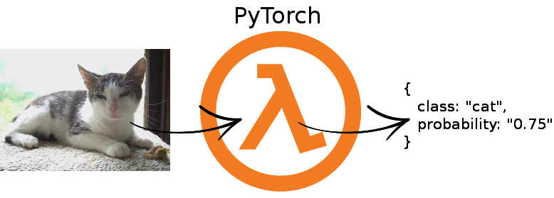
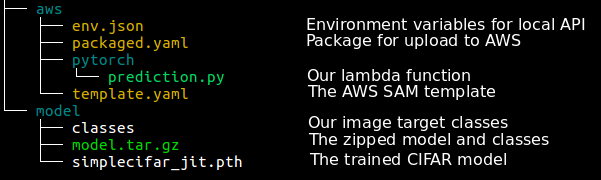

# Serverless PyTorch model serving on AWS with lambda

This project illustrates how to serve a PyTorch model in production as a REST API using a simple CIFAR model for illustration from the [PyTorch CIFAR tutorial](https://pytorch.org/tutorials/beginner/blitz/cifar10_tutorial.html).

## Blog post on paepper.com/blog

For full details about the approach and how to run it yourself, see my [blog post covering the details](https://www.paepper.com/blog/posts/pytorch-model-in-production-as-a-serverless-rest-api/)

## Project Overview

This is the project tree overview:

### Folder model/

Inside this folder are all the files which are relevant to our model. This is:

* The trained PyTorch model: simplecifar_jit.pth
* The target classes of the images: classes
* Both packed together as a bundle for AWS S3: model.tar.gz

### Folder aws/

This folder is for the serverless part. It contains:

* The lambda function: pytorch/prediction.py
* The AWS SAM template: template.yaml
* The packaged bundle to upload to AWS: packaged.yaml
* An environment file to test the lambda function locally: env.json
